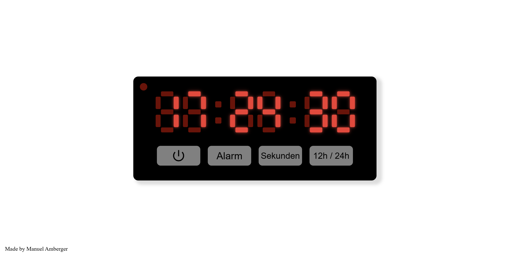

# 7-Segment Digital Clock Web App

A responsive 7-segment digital clock built with HTML, CSS, and JavaScript. It features 12h/24h formats, optional seconds display, start/pause controls, and a settable alarm with blinking PM and input effects.

## Features

- Real-time digital clock display
- 12h / 24h time format toggle
- Optional seconds display
- PM-dot indicator for 12h format
- Alarm functionality:
  - Set alarm via keyboard input
  - Blink effect during alarm input
  - Alarm triggers with blinking PM-dot
  - Delete or disable alarms with visual confirmation
- Start / Pause clock controls
- Persistent settings via localStorage:
  - Last selected time format (12h/24h)
  - Seconds display preference
  - Alarm time and state
- Responsive design for digits, buttons, and icons
- Interactive buttons for clock and alarm management

## Usage

1. Click Start/Pause to run or pause the clock.
2. Toggle seconds display using Sekunden button.
3. Switch between 12h / 24h format using the 12h / 24h button.
4. Click Alarm to start alarm input:
   - Enter hours and minutes using number keys
   - Use Backspace to correct digits
   - For 12h mode, PM-dot toggles automatically
5. After setting, the alarm triggers at the specified time.
6. Click Alarm again to delete or disable an existing alarm.
7. Reloading the page will save existing alarms.

## Technical Notes

- Clock rendering is based on CSS grid 7-segment layout and JavaScript timers (setInterval).
- Alarm input is handled via keyboard events.
- Blinking effects are controlled via JavaScript intervals for segments and PM-dot.
- Settings and alarm state are stored in localStorage for persistence.
- Fully responsive design for buttons, digits, and icons via CSS variables.
- UI is entirely controlles through JavaScript and CSS, no backend required.

  ### Technologies Used
  - HTML5
  - CSS3
  - JavaScript (jQuery)
  - Google Icons

## Preview

## GitHub Page

Link: https://manuel-amberger.github.io/HTML-CSS-JS-7-Segment-Clock/

## About

Created by Manuel Amberger, a student at a technical high school (HTL) in austria.
